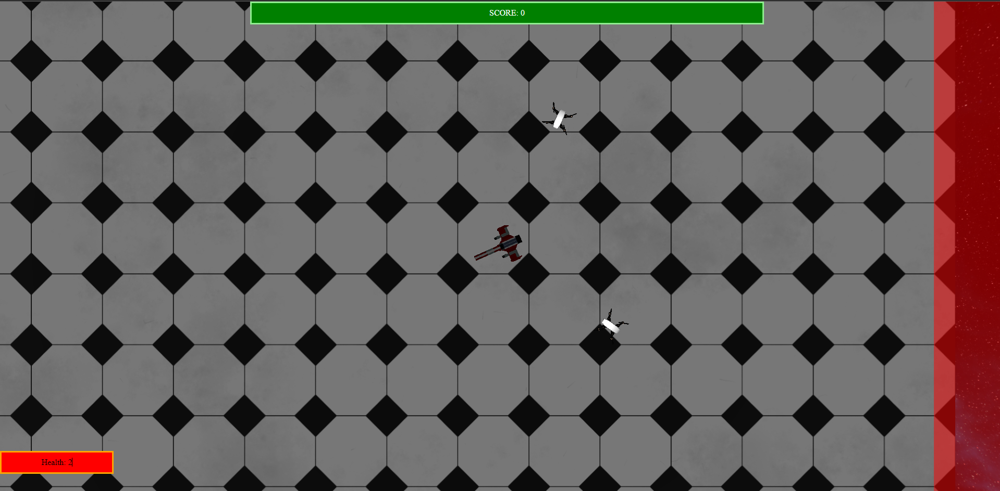

<h1>
  SpaceShooter
</h1>
 

<!-- TABLE OF CONTENTS -->

  
Table of Contents

  <ol>
    <li>
      <a href="#about-the-project">About The Project</a>
      <ul>
        <li><a href="#built-with">Built With</a></li>
      </ul>
    </li>
    <li>
      <a href="#getting-started">Getting Started</a>
    </li>
    <li><a href="#screenshots">Screenshots</a></li>
    <li><a href="#license">License</a></li>
  </ol>

<!-- ABOUT THE PROJECT -->
## About The Project

Simple project of space shooter game.

### Built With
* JavaScript
* ThreeJS

<!-- GETTING STARTED -->
## Getting Started

Start program with 'npx vite' command.

<!-- SCREENSHOTS -->
## Screenshots
MainPage:
  

<!-- LICENSE -->
## License

Distributed under the MIT License. See `LICENSE.txt` for more information.
